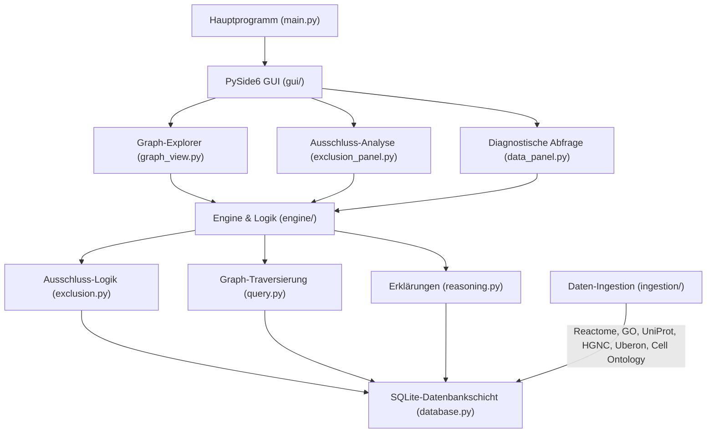

# System-Medizin <!-- last-checked: 2026-07-27 -->

[](https://doi.org/10.5281/zenodo.19429347)
[](LICENSE)
[](https://www.python.org/)
[](https://doc.qt.io/qtforpython/)
[](README.md)

Ein **funktions-pathway-zentrierter medizinischer Wissensgraph** für die Forschung zu Differenzialdiagnosen seltener Erkrankungen, Pathway-Ausschlusslogik und nachvollziehbarem biomedizinischen Graph-Reasoning.

> [!NOTE]
> **LLM- & KI-Agenten-Kontext:** Dieses Repository enthält einen Prototyp eines funktions-pathway-zentrierten medizinischen Wissensgraphen. Architekturdetails, Graph-Ausschluss-Algorithmen und der Datenumfang sind in [`llms.txt`](llms.txt) und [`WHITEPAPER.md`](WHITEPAPER.md) dokumentiert.

> **Nur für Forschungszwecke.** Dies ist kein klinisches Entscheidungsunterstützungssystem, kein Medizinprodukt und darf nicht für Diagnose, Behandlung, Triage oder sonstige medizinische Entscheidungen verwendet werden.

## Schnellstart

| Bedarf | Pfad / Link |
|--------|-------------|
| Konzept & Methodik verstehen | [`WHITEPAPER.md`](WHITEPAPER.md) |
| Software zitieren | [Zenodo v0.7](https://doi.org/10.5281/zenodo.21311232) / [Konzept-DOI](https://doi.org/10.5281/zenodo.19429347) |
| Quellcode untersuchen | [`engine/`](engine/) und [`database.py`](database.py) |
| Prototyp starten | `python main.py`, im Assistenten "Demo-Daten laden" wählen |
| Systemtests ausführen | `python -m pytest -q` |
| Maschinenlesbare Repo-Übersicht | [`llms.txt`](llms.txt) |

## Was ist System-Medizin?

System-Medizin modelliert den menschlichen Körper als ein Netzwerk **funktionaler Pathways** (biologischer Prozesse), die über Gene, Proteine, Laborwerte, anatomische Strukturen, Zelltypen und klinische Diagnosen verknüpft sind. Anstelle einer isolierten Symptom-Zuordnung ermöglicht der Graph-Ansatz:

- **Ausschlusslogik (Exclusion Logic):** Wird ein funktioneller Pathway in einem Szenario als intakt nachgewiesen, können für diesen Pathway essenzielle Gene unter expliziten Annahmen als niederprioritäre Kandidatengene eingestuft werden.
- **Probabilistische Analyse:** Konfidenzwerte für den Gen-Ausschluss basierend auf Pathway-Evidenz, Redundanz und Multi-Pathway-Verstärkung.
- **Mustererkennung:** Automatische Identifikation bekannter Messwert-Signaturen (z. B. Hämolyse, Lupus, Sepsis, Cushing).
- **Diagnostische Forschungsabfragen:** Von auffälligen Messwerten über verdächtige Pathways zu Kandidatengenen und hypothesengeleiteten Folgefragen.

## Datenabdeckung (v0.4)

| Kategorie | Anzahl |
|-----------|--------|
| Funktionale Pathways | 51 |
| Laborparameter | 151 |
| Gene/Proteine | 70 |
| Diagnosen | 68 |
| Messwert-Signaturen | 42 |
| Körperregionen/Anatomie | 28 |
| Zelltypen | 25 |
| Graph-Kanten | 696 |

**Abgedeckte Fachbereiche:** Hämatologie, Hepatologie, Nephrologie, Endokrinologie (Schilddrüse, HPA-Achse, Gonaden, PTH), Immunologie (Komplement, T-Zellen, NK-Zellen, IgE/Allergie), Kardiologie, Onkologie-Marker, Blutgasanalyse, Rheumatologie, Hämostaseologie (inkl. Thrombophilie und Fibrinolyse), Pneumologie, Gastroenterologie (CED, Zöliakie, Exokrine Pankreasinsuffizienz), Infektiologie (Hepatitis-Serologie), Autoimmunologie (Hashimoto, Basedow, PBC, AIH), Urindiagnostik, Neurologie-Marker, Osteologie, Kupferstoffwechsel und Allergologie.

## Installation & Start

### Voraussetzungen

- Python 3.10+
- Windows / Linux / macOS

### Installation

```bash
git clone https://github.com/um-bruch/system-medicine.git
cd system-medicine
pip install -r requirements.txt
```

### Starten

```bash
python main.py
```

Unter Windows kann auch `START.bat` per Doppelklick ausgeführt werden.

Beim ersten Start erscheint ein **Einrichtungsassistent**. Klicken Sie auf "Demo-Daten laden", um alle Datenpanels zu befüllen (Hämolyse-Szenario, klinische Laborpanels, erweiterte Systeme).

## Architektur



## Datenquellen

Dieses Tool integriert ausschließlich **öffentliche, frei zugängliche** biologische Datenbanken:

- [Reactome](https://reactome.org/) -- Pathway-Daten (CC BY 4.0)
- [Gene Ontology](http://geneontology.org/) -- Biologische Prozess-Annotationen (CC BY 4.0)
- [UniProt](https://www.uniprot.org/) -- Protein-Daten (CC BY 4.0)
- [HGNC](https://www.genenames.org/) -- Gen-Nomenklatur (CC0)
- [Uberon](http://uberon.github.io/) -- Anatomie-Ontologie (CC BY 3.0)
- [Cell Ontology](https://obophenotype.github.io/cell-ontology/) -- Zelltyp-Ontologie (CC BY 4.0)

## Lizenz & Rechtlicher Hinweis

MIT License -- siehe [LICENSE](LICENSE).

> **Rechtlicher Hinweis / Legal Notice**
>
> Dieses Projekt ist **kein Medizinprodukt** im Sinne der MDR (EU) 2017/745 / IVDR (EU) 2017/746. Es ist **nicht klinisch validiert**, **nicht durch BfArM oder eine Benannte Stelle geprüft**, **nicht zertifiziert**. Es verarbeitet Daten ausschließlich zu Forschungs- und Softwareentwicklungszwecken. Eine klinische oder diagnostische Nutzung ist ausdrücklich **nicht** die Zweckbestimmung. Entscheidungen über Diagnose und Therapie bleiben qualifizierten Fachpersonen vorbehalten.
